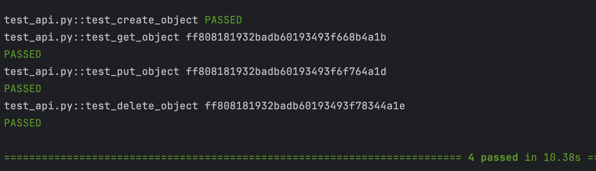

# Тестирование при помощи requests + pytest
### Установить зависимости
```pip install -r requirements.txt```
### Запуск тестов
```pytest -v -s```
#### Сервис - https://restful-api.dev/

<p align="center">
  
</p>
